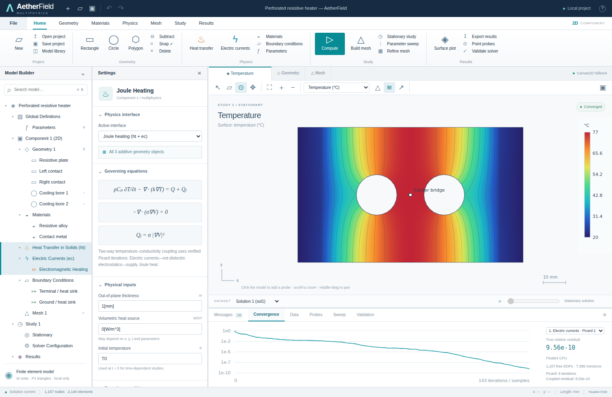

# AetherField

**An independent, local-first 2D finite-element multiphysics workbench.**

Plain HTML, CSS and JavaScript; no frameworks, runtime libraries, CDNs, accounts, remote solvers or build-time dependencies. The interface follows a model-tree → settings → graphics → study/results workflow, with original AetherField branding. This is not COMSOL software, does not include COMSOL code or assets, and does not read `.mph` files.



## Run

Install Node.js 18 or newer, extract the source directory, then:

```sh
cd AetherField
npm start
```

Open `http://localhost:8080`. **There is no `npm install` step.** The initial model meshes and solves automatically. All computation runs in the browser; the Node process serves static files only.

An alternative is the included **`AetherField-standalone.html`**. It contains the complete application and a Blob-based analysis worker and requires no companion files. Open it in a browser. File-origin storage and WebGPU availability differ between browsers, so localhost/HTTPS is the preferred execution environment. The CPU solver and Canvas2D field renderer remain available when WebGPU is unavailable. Use **Save project** to keep a portable copy, especially when local storage is unavailable.

Another port:

```sh
# macOS / Linux
PORT=8088 npm start
# Windows PowerShell
$env:PORT=8088; npm start
```

The server binds to `127.0.0.1`, serves only its source directory, and uses a local-only Content Security Policy. Deploy the same static files to an HTTPS host for remote access; there is no application server or database to deploy.

## What works

| Area | Implemented behavior |
|---|---|
| Geometry | Rectangles, circles and simple polygons; ordered additive/material-overwrite and subtractive operations; pointer construction, drag, corner-handle resize, numeric expressions, duplication, reordering, deletion and grid snapping |
| Materials | Per-additive-object assignment; scalar thermal conductivity, density, heat capacity, electrical conductivity, relative permittivity, and temperature coefficient of electrical resistivity |
| Physics | 2D heat conduction, dielectric electrostatics, DC electrical conduction, and two-way temperature-dependent Joule heating |
| Boundaries | Prescribed temperature/potential, insulation/zero flux, inward heat/current/displacement flux, thermal convection; semantic selections and exposed-edge picking |
| Meshing | Boundary-conforming linear triangles, explicit material interfaces, polygonized circular holes, quality field/histogram, topology checks, connected-component checks and refinement/coarsening |
| Studies | Stationary; consistent-mass backward-Euler thermal transients; quasistatic electric solves at each time; parameter sweeps that remesh each case |
| Visualization | Interpolated nodal temperature/potential, element heat flux/electric field/Joule density, contours, vector arrows, mesh overlay, hover values, point probes, time playback and dataset selection |
| Solver | Float64 CSR finite-element assembly; strong symmetric Dirichlet elimination; Jacobi-PCG; genuine WGSL GPU CG with Float64 acceptance/correction; true residual, iteration history, nonlinear residual, heat balance and reactions |
| Data | Nodal and elemental CSV, time-history CSV, legacy VTK, full result JSON and PNG; versioned `.afield` project files; local input autosave and bounded atomic undo/redo |
| Validation | 16 numerical/analytical regression tests and 11 automated browser integration checks; a separate GPU-only verification page |

Inputs are real. Editing geometry, materials, loads, boundary values or study settings invalidates the affected result. A failed or cancelled computation does not leave an old field labeled “Converged.” Unit expressions are interpreted by a restricted parser, not JavaScript `eval`.

## First workflows

### Two-way Joule heater

The startup model is a 100 × 60 mm plate, 1 mm thick, with two 9 mm-radius holes and 10 mm contact strips. The left terminal is at 0.8 V, the right at 0 V. Both end faces are at 293.15 K. Other boundaries, including the holes, are initially insulated. Material values are illustrative, not a certified material database.

Select **Global Definitions → Parameters**, change `Vapp`, and press **Compute**. Select **Electric Potential**, **Joule Heating**, or a field in the graphics toolbar. Select **Results** to inspect extrema and integrated power. The **Convergence** panel contains a selector for every recorded linear solve, not a generated progress curve.

Press **B** and click a hole edge. Choose **Convection**, enter a heat-transfer coefficient and ambient temperature, and compute again. The selected condition covers the polygonized circular boundary via its persistent `hole1:curve`/`hole2:curve` tag.

### Heat and electrostatics

Open **Home → Model library**. The thermal slab has prescribed end temperatures and insulated sides; the capacitor has prescribed end potentials and insulated sides. The thermal midpoint is approximately 333.15 K and the capacitor midpoint approximately 5 V with the supplied settings.

The electrostatic interface solves a dielectric Poisson equation. Its volume source is charge density in C/m³. It does **not** generate Joule heat. Joule heating uses the distinct **Electric Currents** interface and `sigma * |grad(V)|²`.

### Geometry editing

Select **Geometry** or use **R** / **C** to draw rectangles/circles. Polygon drawing accepts successive clicks and finishes with Enter. The subtract toggle creates holes/notches instead of additive regions. Later additive objects overwrite the material in an overlap; subtractive objects remove existing regions. Move a subtractive object to the end of the construction order to ensure it also cuts later additive objects.

Use **S** to select and drag objects. Drag a corner handle to resize. Alt temporarily bypasses 1 mm snapping. Enter exact dimensions and parameter expressions in Settings. Direct manipulation intentionally replaces affected parameterized dimensions with concrete SI values. A completed gesture is one undo transaction.

The mesh retains object-edge identities. “Left/right/top/bottom” mean the exposed edges on the global bounding box, not every left-facing/right-facing edge. A deleted, obscured or no-longer-exposed boundary selection causes a diagnostic rather than silently moving a condition elsewhere.

### Transient and sweep

Use **Study → Time dependent**; enter `dt`, end time and initial temperature. Thermal dynamics use a consistent mass matrix and implicit backward Euler. Select frames or play the time sequence. Electric fields in time-dependent studies are quasistatic solutions to the boundary data at each frame; displacement-current/RC/electromagnetic time evolution is not modeled.

For a sweep, enable it in Study settings, choose an existing parameter, and supply expressions such as:

```text
0.4[V], 0.6[V], 0.8[V], 1[V]
```

A sweep may affect geometry, so each case is remeshed, not just rescaled. All cases have independent meshes, frame arrays, probe samples and convergence records. The dataset selector changes the displayed case.

## Units and expressions

Computations and exports use SI; temperature is stored in kelvin and displayed in Celsius. Explicit unit expressions are recommended:

```text
10[mm]
25[degC]
16[W/(m*K)]
7800[kg/m^3]
500[J/(kg*K)]
0.002[1/K]
0.8[V] * (1 + 0.2*sin(2*pi*t/10[s]))
300[K] + 10[K]*sin(pi*x/1[m])
```

The parser supports explicit multiplication, arithmetic, powers, parentheses, `sin`, `cos`, `tan`, `exp`, `log`, `sqrt`, `abs`, `min`, `max`, and named parameters. Coordinates `x,y` have units of metres and `t` seconds. Sources and boundary values can depend on `x,y,t`; materials are evaluated from parameters, with the built-in temperature-dependent conductivity law providing nonlinear dependence. Parameter cycles, undefined names, invalid units and nonfinite evaluations are rejected.

**Convention:** a wholly dimensionless expression entered into a dimensioned input is interpreted as a bare SI value. Thus `10` in a length field means 10 m, not 10 mm. Inside a mixed expression, dimensions must still agree: write `L + 5[mm]`, not `L + 5`. `degC` is an absolute-temperature literal conversion; use kelvin for temperature differences. This is dimensional checking, not a complete affine-temperature type system.

## Reproducible computed example

`examples/heater-results.json`, CSV and VTK contain an actual Float64 CPU solution regenerated by `npm run examples`:

| Quantity | Computed value |
|---|---:|
| Nodes | 1,157 |
| Triangles | 2,140 |
| Minimum quality | 0.4762554177 |
| Peak temperature | 350.1463423467 K / 76.9963423467 °C |
| Integrated Joule power | 4.2815167613 W |
| Maximum electric-field magnitude | 16.9216425287 V/m |
| Nonlinear iterations | 9 |
| Accepted coupled relative residual | 9.5348611 × 10⁻¹⁰ |

These are outputs of this discretization, not reference values for a manufactured commercial heater. Circular holes have 24 straight segments at this resolution. Refine spatial and temporal discretization independently before interpreting a design result.

Five editable examples and their computed summaries are included: heater, thermal slab, capacitor, transient diffusion and four-point voltage sweep. Project files save inputs, not computed fields; full result JSON is a separate export and is not currently reimported as a cached dataset.

## Validation and GPU status

```sh
npm test                    # analytical/numerical suite; writes tests/results.json
npm run examples            # recompute reference exports
npm run build:standalone    # regenerate the one-file distribution
```

Optional UI automation requires Python Playwright installed separately; it is not an application dependency:

```sh
python tests/browser.py --chromium /path/to/chromium
python tests/browser.py --chromium /path/to/chromium --url http://127.0.0.1:8080
```

The included recorded results show **16/16 numerical tests** and **11/11 browser integration tests**, with no page errors. Browser tests exercise actual worker computation, geometry manipulation, boundary assignment, transient playback, probe exclusion from holes, sweeps and real downloads/upload round trips.

**GPU verification boundary:** this delivery environment exposed no WebGPU API to the available offline browser context. Therefore the recorded UI and numerical results validate the **Float64 CPU + Canvas2D fallback**. The WGSL compute/render paths are implemented, but have **not been executed or performance-benchmarked here**. Hardware speedup, browser/device compatibility and GPU shader execution must not be inferred from the CPU test report.

To test a real adapter, start the server and open:

```text
http://localhost:8080/tests/gpu-check.html
```

That page requires actual GPU dispatches and accepted GPU-backed solutions, compares heat/electrostatic/Joule fields with Float64 CPU references, creates the native GPU render pipeline, and reports PASS, FAIL or NOT RUN. It refuses to call a CPU fallback a GPU pass. The app's graphics status reports its renderer, while its bottom status reports recorded compute dispatches. Rendering availability and compute-worker availability are independent.

WebGPU mode runs a diagonally scaled f32 CSR conjugate-gradient iteration. Every candidate is checked/corrected with the original Float64 system before acceptance. **This is a mixed-precision solver, not an f64 GPU solver.** On small meshes, dispatch/readback overhead can outweigh parallelism. No GPU performance claim is made by this release.

## Architecture

```text
core/units.js        Restricted AST expressions, dimensional quantities, parameters
core/model.js        Project schema, validation, identities, atomic history
core/geometry.js     Primitive polygonization, ordered CSG classification, predicates
core/mesh.js         PSLG splitting, Delaunay triangulation, constraints, spatial hash
core/sparse.js       CSR pattern/scatter, Dirichlet reduction, Float64 Jacobi-PCG
core/fem.js          Element/boundary assembly, material coefficients, derived fields
core/gpu.js          WGSL sparse CG, reductions, readback, Float64 verification
core/study.js        Stationary, backward Euler, Picard coupling, sweeps, probes
core/worker.js       Job isolation, progress and transferable typed-array results
core/io.js           Project parsing, CSV, VTK, full result JSON
view/renderer.js     Native WebGPU fields, accurate CPU fallback and overlays
app.js               Plain DOM workbench, transactions, editing and commands
```

See [Numerical formulation](docs/NUMERICS.md), [Architecture and invariants](docs/ARCHITECTURE.md), and [Verification record](docs/VERIFICATION.md).

## Current engineering boundaries

This is a functioning scoped implementation, **not feature parity with a commercial multiphysics platform or a certified production solver**. It supports planar, isotropic, first-order triangular conduction problems. It does not implement 3D, axisymmetry, anisotropic tensors, high-order curved elements, radiation, advection/flow, structural mechanics, contact thermal resistance, circuit coupling, Maxwell transients, adaptive error estimation, Newton/Krylov nonlinear solves, multigrid or CAD B-rep import.

The mesher uses normalized Float64 predicates and explicit degeneracy rejection, not exact adaptive predicates. Bowyer–Watson insertion is quadratic in the worst case; start with modest meshes. The node budget defaults to 18,000 and is capped at 30,000. There are limits of 500 time steps, 16 sweep cases and retained element-frames to protect browser memory. Quality statistics inspect the mesh; they do not guarantee an angle/conditioning bound on arbitrary sliver geometry.

Convergence of the linear/nonlinear algebra is not proof of discretization accuracy or physical model validity. Independently check mesh/time convergence, energy balance, boundary assumptions and material data before engineering use. Local input autosave is browser storage, not a backup.

## License and references

MIT license for this implementation; see [LICENSE](LICENSE). No external runtime code is bundled. System fonts are referenced, not distributed.

Primary background references: [MFEM finite-element examples](https://mfem.org/examples/), [COMSOL's discussion of the electric-current/Joule-heating equations](https://www.comsol.com/support/learning-center/course/defining-multiphysics-models-122/viewing-and-accessing-the-equations-and-variables-for-physics-feature-nodes-30761), [W3C WebGPU](https://www.w3.org/TR/webgpu/), [WGSL](https://www.w3.org/TR/WGSL/), and [Chrome's secure-context/GPU troubleshooting documentation](https://developer.chrome.com/docs/web-platform/webgpu/troubleshooting-tips). The implementation is independent; the references are not dependencies.
